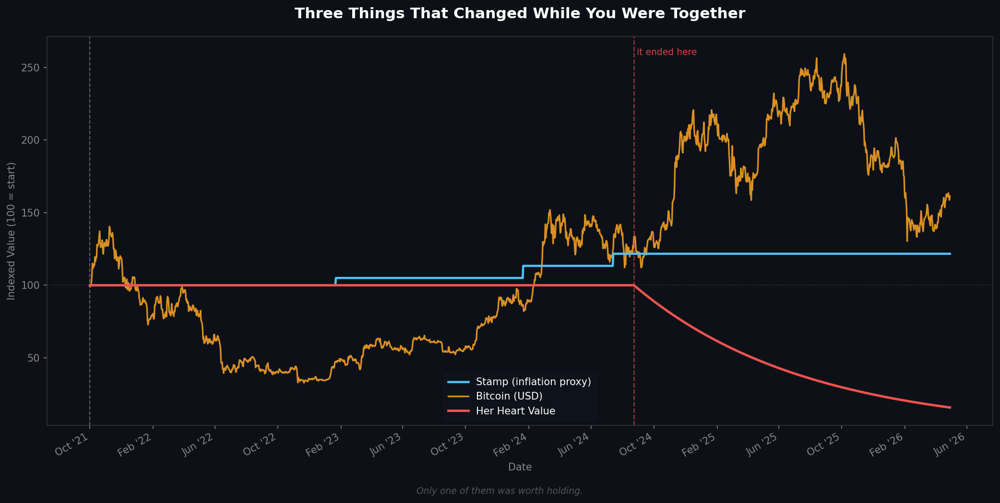

# Unrealized-Loss

> *In finance, an unrealized loss is a paper loss that exists on paper but hasn't been locked in yet.*  
> *This repo tracks the one that already has.*


---

## Stamp. Bitcoin. Her Heart.

Three assets. Same start date. One chart.

```
Oct 1, 2021  →  relationship_start
Aug 23, 2024 →  relationship_end  ("it ended here")
Today        →  still running
```

A data project comparing three things that all changed value over the same period of time.  
One is backed by the US government.  
One is backed by no one.  
One was backed by her.

---

## Sample Output



*"Only one of them was worth holding."*

---

## How It Works

All three assets are indexed to **100** at `2021-10-01` and tracked daily through today.

| Asset | Source | Behavior |
|-------|--------|----------|
| 🔵 **Stamp** | USPS historical rate table | Step-function — goes up, never down |
| 🟠 **Bitcoin** | Yahoo Finance (free, no API key) | Volatile daily close price |
| 🔴 **Her Heart** | Mathematical formula | Exponential decay after end date |

### Heart Index Formula

```python
heart(t) = 100 × e^(−0.003 × days_since_end)
```

- Starts at `100` on `relationship_start`
- Holds steady through `relationship_end`
- Decays continuously after — half-life ~231 days
- Floor: `0` — no recovery logic

### Metrics

| Metric | Stamp | Bitcoin | Her Heart |
|--------|-------|---------|-----------|
| Total Return | +21.67% | +78.72% | −83.42% |
| Max Drawdown | 0% | −88.19% | −83.42% |
| Final Value | ~121 | ~178 | ~16 |

---

## Project Structure

```
Unrealized-Loss/
├── data/
│   ├── btc_prices.csv        # Bitcoin daily close (Yahoo Finance)
│   ├── stamp_prices.csv      # USPS stamp price history 1974–present
│   └── heart_index.csv       # Generated decay curve
├── src/
│   ├── fetch_btc.py          # Pull BTC data · error-handled
│   ├── fetch_stamp.py        # Load + forward-fill stamp prices
│   ├── generate_heart.py     # Compute exponential decay
│   ├── calculate_index.py    # Normalize + compute metrics
│   └── visualize.py          # Dark-theme chart generation
├── output/
│   └── chart.png             # Auto-regenerated every day
├── .github/
│   └── workflows/
│       ├── daily_update.yml  # Runs every day at 09:00 UTC
│       └── lint.yml          # Ruff + Black on every push
├── .gitignore
├── requirements.txt
└── README.md
```

---

## Getting Started

No API keys. No paid services. Just Python.

```bash
# Clone
git clone https://github.com/nattapongsindhu/Unrealized-Loss
cd Unrealized-Loss

# Install
pip install -r requirements.txt

# Run pipeline
python src/fetch_btc.py        # fetch BTC prices
python src/generate_heart.py   # generate heart index
python src/calculate_index.py  # print metrics
python src/visualize.py        # save chart → output/chart.png
```

---

## Automation

This repo updates itself every day.

```
09:00 UTC daily
    → fetch latest BTC price
    → extend heart index by 1 day
    → regenerate chart.png
    → git commit + push
    → contribution graph stays green 🟩
```

Set up once. Never touch again.

**To enable on your fork:**  
`Settings → Actions → General → Workflow permissions → Read and write → Save`

---

## Data Sources

| Data | Source | Type |
|------|--------|------|
| Bitcoin price | [Yahoo Finance via yfinance](https://pypi.org/project/yfinance/) | Live API (free) |
| Stamp prices | USPS historical rate table | Static CSV |
| Heart Index | `100 × e^(−0.003t)` | Generated |

---

## Why This Exists

Most GitHub automation projects are pointless loops — committing timestamps into a void.

This one tells a story.

It has a start date that meant something.  
An end date that also meant something.  
And a decay curve that keeps going whether you check it or not.

The stamp keeps going up.  
Bitcoin does what Bitcoin does.  
The red line just goes down.

---

*Built by [Nattapong Sindhu](https://github.com/nattapongsindhu) · USPS Maintenance Mechanic · IT Cybersecurity Student · Los Angeles, CA*
